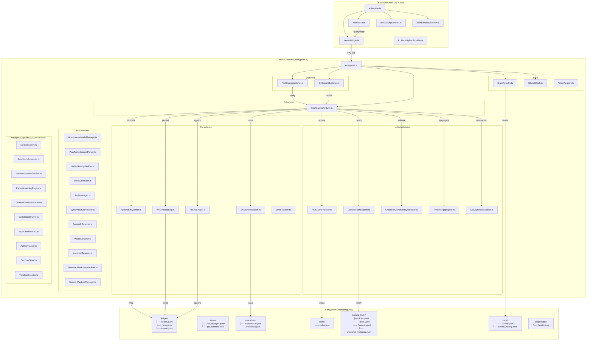
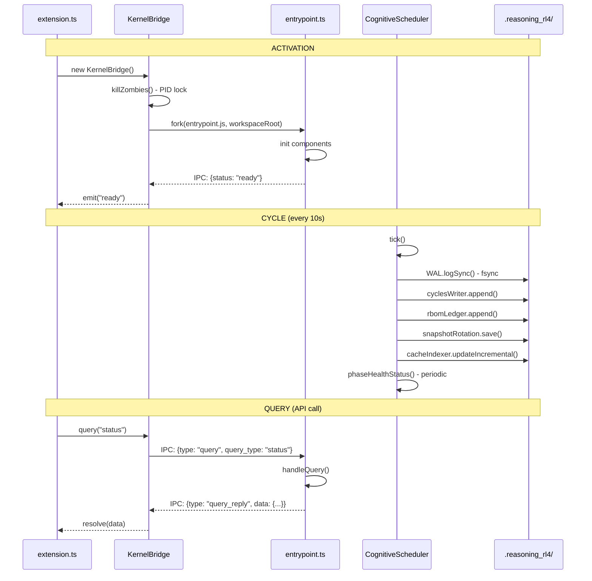
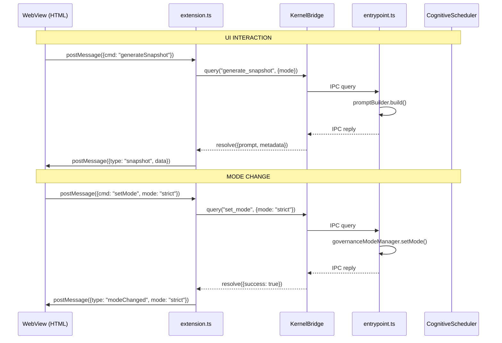

# NORTHSTAR v3 — BIBLE RUNTIME RL6 (CANONIQUE)

**Version**: 3.0.0  
**Date**: 2025-01-15  
**Statut**: CANONIQUE — VÉRIFIÉ PAR INSPECTION DU CODE + VISION MIL  

> ⚠️ Ce document distingue clairement 3 couches :
> - **[RÉALITÉ]** — Ce qui existe dans le code RL6 actuel
> - **[HÉRITÉ]** — Ce qui était stable dans le dump VSIX / RL4 legacy
> - **[CIBLE]** — Ce que RL6 doit devenir (avec MIL + CursorChatListener)

---

## SOMMAIRE

1. [Section 1 — Architecture RL6 Observée](#section-1--architecture-rl6-observée-réalité)
2. [Section 2 — Architecture RL4 Stable (Dump)](#section-2--architecture-rl4-stable-dump-hérité)
3. [Section 3 — DIFF RL6 vs RL4 vs Dump](#section-3--diff-rl6-vs-rl4-vs-dump)
4. [Section 4 — Invariants Mécaniques (Vérifiés)](#section-4--invariants-mécaniques-vérifiés)
5. [Section 5 — Plan de Migration RL6 → RL6-STABLE](#section-5--plan-de-migration-rl6--rl6-stable)
6. [Section 6 — Workflow Kernel ↔ UI Conforme](#section-6--workflow-kernel--ui-conforme)
7. [Section 7 — API Réelle Uniquement](#section-7--api-réelle-uniquement)
8. [Section 8 — Modules à Supprimer / Inspecter / Compléter](#section-8--modules-à-supprimer--inspecter--compléter)
9. [Section 9 — Ligne Directrice pour Optimisation](#section-9--ligne-directrice-pour-optimisation)
10. [Section 10 — VISION CIBLE : MIL + CursorChatListener](#section-10--vision-cible--mil--cursorchatlistener) ⭐ NOUVEAU
11. [Annexes](#annexes)

---

## Section 1 — Architecture RL6 Observée [RÉALITÉ]

### 1.1 Diagramme Runtime Actuel (Vérifié)



### 1.2 Fichiers Vérifiés et Leurs Rôles RÉELS

| Fichier | Rôle Réel (Vérifié) | Lignes | Statut |
|---------|---------------------|--------|--------|
| `extension.ts` | Entrypoint extension, init KernelBridge, listeners, commands | ~350 | ✅ Complet |
| `kernel/process/entrypoint.ts` | Entrypoint kernel, init composants, IPC handlers | ~400 | ⚠️ Stubs (reflect, get_last_cycle_health) |
| `kernel/process/KernelBridge.ts` | IPC fork/send, heartbeat, crash recovery, PID lock | ~300 | ✅ Complet |
| `kernel/KernelAPI.ts` | API publique extension→kernel, 30+ endpoints | ~595 | ✅ Complet |
| `kernel/CognitiveScheduler.ts` | Orchestrateur cycles, 5 phases | ~400 | ✅ Complet |
| `kernel/AppendOnlyWriter.ts` | Écriture JSONL append-only, retry, fsync | ~150 | ✅ Complet |
| `kernel/StateRegistry.ts` | État kernel, snapshot, history | ~300 | ✅ Complet |
| `kernel/persistence/WriteAheadLog.ts` | WAL sync, fsync garanti | ~60 | ✅ Complet |
| `kernel/rbom/RBOMLedger.ts` | Registry append-only événements | ~100 | ✅ Complet |
| `kernel/indexer/SnapshotRotation.ts` | Rotation, compression gzip, metadata | ~820 | ✅ Complet |
| `kernel/indexer/CacheIndex.ts` | Index incrémental, by_day/by_file/by_hour | ~312 | ✅ Complet (méthode updateIncremental) |
| `kernel/ground_truth/GroundTruthSystem.ts` | Baseline YAML, hash, drift detection | ~200 | ✅ Complet |
| `kernel/HealthMonitor.ts` | Métriques health, event loop lag, alertes | ~200 | ✅ Complet |
| `kernel/WriteTracker.ts` | Singleton, track internal writes | ~90 | ⚠️ Partiel (non utilisé partout) |
| `kernel/validation/CrossFileConsistencyValidator.ts` | Validation JSON, dépendances, circular | ~697 | ✅ Complet |
| `kernel/api/ActivityReconstructor.ts` | Reconstruction tasks/bursts/focus | ~937 | ✅ Complet |
| `kernel/api/GovernanceModeManager.ts` | Modes governance (strict/flexible/etc.) | ~187 | ✅ Complet |
| `kernel/modes/ModesSystem.ts` | Modes kernel (stable/exploratory/etc.) | ~566 | ❌ VESTIGE (doublon avec GovernanceModeManager) |
| `kernel/api/DeltaCalculator.ts` | Git status/diff, severity | ~185 | ✅ Complet |
| `kernel/api/SystemStatusProvider.ts` | Status, FAQ, logs export | ~226 | ✅ Complet |

### 1.3 DEUX SYSTÈMES DE MODES (CONFUSION CRITIQUE)

**DÉCOUVERTE** : Il existe DEUX systèmes de modes distincts dans RL6 :

| Système | Fichier | Modes | Usage |
|---------|---------|-------|-------|
| **Modes Governance** | `GovernanceModeManager.ts` | strict, flexible, exploratory, free, firstUse | UI/WebView, validation gouvernance |
| **Modes Kernel** | `ModesSystem.ts` | STABLE, EXPLORATORY, RECOVERY, PERFORMANCE, STRICT | Runtime kernel, comportement interne |

⚠️ **PROBLÈME** : `ModesSystem.ts` est un **vestige** — son rôle est couvert par `GovernanceModeManager.ts` pour la gouvernance et `StateRegistry.ts` pour l'état kernel.

### 1.4 PROBLÈME STRUCTUREL IDENTIFIÉ : DÉCORRÉLATION DES SIGNAUX

**SYMPTÔME OBSERVÉ** :
- Chaque listener (FileChangeWatcher, GitCommitListener, IDEActivityListener) écrit dans son propre fichier JSONL
- Formats différents : `CaptureEvent`, `RBOMEntry`, `IDESnapshot`
- Pas de séquence globale : chaque source a son propre compteur/timestamp
- Pas de références croisées : impossible de lier un commit à un chat
- Pas d'index temporel unifié : requêtes O(n) sur tous les fichiers
- Pas de compression contextuelle : duplication de données
- Pas de mémoire sémantique : décisions/intentions non persistées

**CONSÉQUENCES** :
- ❌ Impossible de reconstruire clairement "pourquoi" un commit existe
- ❌ Impossible de relier une décision prise dans un chat à un changement de fichier
- ❌ Impossible de faire émerger des tendances, décisions, intentions
- ❌ Impossible de produire un contexte LLM stable et vérifiable
- ❌ La Time Machine est puissante mais aveugle : elle n'a pas accès à une mémoire consolidée

**CAUSE RACINE** :
Absence d'une couche d'abstraction unifiée entre :
- Les listeners (sources d'événements)
- Les traces (stockage append-only)
- Les consommateurs (UnifiedPromptBuilder, TimeMachine, etc.)

Cette couche devrait :
1. Normaliser tous les événements dans un schéma commun
2. Indexer temporellement pour des requêtes efficaces
3. Construire un graphe de relations entre événements
4. Compresser le contexte pour une réutilisation efficace
5. Exposer une API de requête unifiée

---

## Section 2 — Architecture RL4 Stable (Dump) [HÉRITÉ]

### 2.1 Comportements Stables Observés dans le Dump

Le dump `/DUMP/Part1-6` contient le code webpack minifié d'une version VSIX stable. Voici les comportements identifiés :

| Module Dump | Comportement Stable | Existe dans RL6 ? |
|-------------|---------------------|-------------------|
| Module 8491 (PlanTasksContextParser) | Parse Plan.RL4, Tasks.RL4, mode validation | ✅ Oui |
| Module 8995 (SnapshotRotation) | Rotation 30 snapshots, compression gzip | ✅ Oui |
| Module 9609 (CrossFileConsistencyValidator) | Validation circular deps, JSON schema | ✅ Oui |
| Module 8490 (ActivityReconstructor) | Tasks/bursts/focus reconstruction | ✅ Oui |
| Module 9319 (ModesSystem) | Modes kernel adaptation | ⚠️ Vestige (à supprimer) |
| WebView Manager | Gestion tabs, IPC frontend | ✅ Oui (RL4WebViewManager.ts) |
| Prompt Aggregator | Assemblage prompt unifié | ⚠️ Partiel (UnifiedPromptBuilder) |

### 2.2 Modes Governance dans RL4 Legacy (NORTHSTAR.md)

Le fichier `/Reasoning Layer V3/NORTHSTAR.md` définit l'état machine des modes :

```
firstUse → firstUseExtended (après 3 snapshots)
firstUseExtended → strict (low risk, no high git delta)
strict ↔ flexible (risque moyen)
flexible → exploratory (après validation)
exploratory → free (après validation longue)
```

Ce modèle est **PARTIELLEMENT** implémenté dans `GovernanceModeManager.ts` (modes existent, transitions manuelles).

---

## Section 3 — DIFF RL6 vs RL4 vs Dump

### 3.1 Table DIFF Complète

| Fichier RL6 | État Actuel | Attendu RL6 | Diff Réel | Risque |
|-------------|-------------|-------------|-----------|--------|
| `extension.ts` | Complet | — | Aucun | ✅ |
| `entrypoint.ts` | Stubs `reflect`, `get_last_cycle_health` | Implémentés | Handlers incomplets | ⚠️ MEDIUM |
| `KernelBridge.ts` | Complet | — | Aucun | ✅ |
| `KernelAPI.ts` | Complet, 30+ endpoints | — | Aucun | ✅ |
| `KernelBootstrap.ts` | Présent mais inutilisé | Supprimer ou documenter | Alternative inutilisée | ⚠️ LOW |
| `CognitiveScheduler.ts` | 5 phases fonctionnelles | — | Aucun | ✅ |
| `AppendOnlyWriter.ts` | Complet, retry, fsync | — | Aucun | ✅ |
| `WriteAheadLog.ts` | fsync garanti | — | Aucun | ✅ |
| `RBOMLedger.ts` | Append-only | — | Aucun | ✅ |
| `StateRegistry.ts` | Complet | — | Aucun | ✅ |
| `SnapshotRotation.ts` | Complet, gzip | — | Aucun | ✅ |
| `CacheIndex.ts` | updateIncremental existe | — | Aucun | ✅ |
| `GroundTruthSystem.ts` | Complet | — | Aucun | ✅ |
| `HealthMonitor.ts` | Complet | — | Aucun | ✅ |
| `WriteTracker.ts` | Singleton, utilisé partiellement | Utilisé partout | 6 fichiers l'utilisent, ~10 devraient | ⚠️ MEDIUM |
| `GovernanceModeManager.ts` | Complet, WriteTracker, WAL | — | Aucun | ✅ |
| `ModesSystem.ts` | VESTIGE, doublon | Supprimer | Confusion avec GovernanceMode | ❌ HIGH |
| `FeedbackEvaluator.ts` | VESTIGE cognitif | Supprimer | Calcule accuracy/stability | ❌ HIGH |
| `PatternEvolutionTracker.ts` | VESTIGE cognitif | Supprimer | Tracking patterns | ❌ HIGH |
| `PatternLearningEngine.ts` | VESTIGE cognitif | Supprimer | Learning patterns | ❌ HIGH |
| `TerminalPatternsLearner.ts` | VESTIGE cognitif | Supprimer | Terminal learning | ❌ HIGH |
| `CorrelationEngine.ts` | VESTIGE cognitif | Supprimer | Corrélations | ❌ HIGH |
| `ADRGeneratorV2.ts` | VESTIGE cognitif | Supprimer | Génération ADR | ❌ HIGH |
| `AdHocTracker.ts` | VESTIGE cognitif | Supprimer | Tracking ad-hoc | ❌ HIGH |
| `DecoderSpec.ts` | VESTIGE, dépend RL4Messages | Supprimer | Dépendance legacy | ❌ HIGH |
| `TimelineEncoder.ts` | VESTIGE, dépend RL4Codec | Supprimer | Dépendance legacy | ❌ HIGH |
| `RL4Messages.ts` | Legacy | Supprimer | Dans kernel/legacy/rl4 | ❌ HIGH |
| `RL4Codec.ts` | Legacy | Supprimer | Dans kernel/legacy/rl4 | ❌ HIGH |
| `RL4Dictionary.ts` | Legacy | Supprimer | Dans kernel/legacy/rl4 | ❌ HIGH |
| WebView Manager | ✅ COMPLET | — | RL4WebViewManager.ts + 37 composants React | ✅ |

### 3.2 WriteTracker — Analyse d'Utilisation

**Fichiers qui utilisent WriteTracker** :
1. `CognitiveScheduler.ts` ✅
2. `ArtifactWriter.ts` ✅
3. `FileChangeWatcher.ts` ✅
4. `PlanTasksContextParser.ts` ✅
5. `GovernanceModeManager.ts` ✅
6. `WriteTracker.ts` (définition) ✅

**Fichiers qui DEVRAIENT utiliser WriteTracker mais NE LE FONT PAS** :
1. `AppendOnlyWriter.ts` ❌
2. `RBOMLedger.ts` ❌
3. `SnapshotRotation.ts` ❌
4. `StateRegistry.ts` ❌
5. `HealthMonitor.ts` ❌

---

## Section 4 — Invariants Mécaniques (Vérifiés)

### 4.1 Table des Invariants

| ID | Invariant | RL4 Dump | RL6 Code | Conclusion |
|----|-----------|----------|----------|------------|
| I01 | cycleId strictement monotone | ✅ GlobalClock.seq | ✅ GlobalClock.seq | **OK** |
| I02 | append-only cycles.jsonl | ✅ AppendOnlyWriter | ✅ AppendOnlyWriter | **OK** |
| I03 | WAL écrit AVANT cycles.jsonl | ✅ phasePersistCycle | ✅ phasePersistCycle | **OK** |
| I04 | WAL fsync garanti | ✅ fs.fsyncSync | ✅ fs.fsyncSync | **OK** |
| I05 | RBOM append chaque cycle | ✅ phasePersistCycle | ✅ phasePersistCycle | **OK** |
| I06 | WriteTracker pour TOUT | ⚠️ Partiel | ⚠️ 6/~15 fichiers | **PARTIEL** |
| I07 | Rotation snapshots | ✅ SnapshotRotation | ✅ SnapshotRotation | **OK** |
| I08 | Index incrémental | ✅ updateIncremental | ✅ updateIncremental | **OK** |
| I09 | State atomic snapshot | ✅ StateRegistry | ✅ StateRegistry | **OK** |
| I10 | Ready IPC handshake | ✅ KERNEL_READY:true | ✅ KERNEL_READY:true | **OK** |
| I11 | Watchers non-cognitifs | ✅ FileChangeWatcher | ✅ FileChangeWatcher | **OK** |
| I12 | Reconstruction mécanique | ✅ ActivityReconstructor | ✅ ActivityReconstructor | **OK** |
| I13 | Ground truth établi avant drift | ✅ GroundTruthSystem | ✅ GroundTruthSystem | **OK** |
| I14 | Health event loop lag monitoring | ✅ HealthMonitor | ✅ HealthMonitor | **OK** |
| I15 | PID lock zombie kill | ✅ KernelBridge | ✅ KernelBridge | **OK** |
| I16 | Heartbeat timeout crash detect | ✅ KernelBridge | ✅ KernelBridge | **OK** |
| I17 | Scheduler tick 10s | ✅ CognitiveScheduler | ✅ CognitiveScheduler | **OK** |
| I18 | Compression gzip snapshots | ✅ zlib.gzip | ✅ zlib.gzip | **OK** |
| I19 | Modes governance persist Context.RL4 | ✅ GovernanceModeManager | ✅ GovernanceModeManager | **OK** |
| I20 | AtomicFS write temp+rename | ✅ AtomicFS | ✅ AtomicFS | **OK** |

### 4.2 Invariants NON GARANTIS

| ID | Invariant | Problème | Priorité |
|----|-----------|----------|----------|
| I06 | WriteTracker systématique | 6/15 fichiers l'utilisent | P1 |
| I21 | reflect handler implémenté | Stub dans entrypoint.ts | P0 |
| I22 | get_last_cycle_health implémenté | Stub dans entrypoint.ts | P0 |
| I23 | Pas de vestiges cognitifs | 10+ fichiers cognitifs présents | P0 |

---

## Section 5 — Plan de Migration RL6 → RL6-STABLE

### 5.1 Phase P0 — Stubs et Vestiges (Bloquant)

| Tâche | Fichiers | Action | Critère Complétion |
|-------|----------|--------|-------------------|
| P0.1 | `entrypoint.ts:132-143` | Implémenter handler `reflect` | `scheduler.runCycle()` appelé |
| P0.2 | `entrypoint.ts:120-130` | Implémenter handler `get_last_cycle_health` | Retourne dernier CycleResult |
| P0.3 | `kernel/cognitive/` | Supprimer 8 fichiers cognitifs | Dossier vide ou supprimé |
| P0.4 | `kernel/modes/ModesSystem.ts` | Supprimer | Fichier absent |
| P0.5 | `kernel/rl4/DecoderSpec.ts` | Supprimer | Fichier absent |
| P0.6 | `kernel/rl4/TimelineEncoder.ts` | Supprimer | Fichier absent |
| P0.7 | `kernel/legacy/rl4/` | Supprimer dossier entier | Dossier absent |

**Fichiers cognitifs à supprimer (P0.3)** :
```
kernel/cognitive/FeedbackEvaluator.ts
kernel/cognitive/PatternEvolutionTracker.ts
kernel/cognitive/PatternLearningEngine.ts
kernel/cognitive/TerminalPatternsLearner.ts
kernel/cognitive/CorrelationEngine.ts
kernel/cognitive/ADRGeneratorV2.ts
kernel/cognitive/AdHocTracker.ts
kernel/cognitive/ForecastEngine.ts
```

### 5.2 Phase P1 — WriteTracker Systématique

| Tâche | Fichiers | Action | Critère Complétion |
|-------|----------|--------|-------------------|
| P1.1 | `AppendOnlyWriter.ts` | Ajouter WriteTracker.markInternalWrite | grep "WriteTracker" renvoie match |
| P1.2 | `RBOMLedger.ts` | Ajouter WriteTracker.markInternalWrite | grep "WriteTracker" renvoie match |
| P1.3 | `SnapshotRotation.ts` | Ajouter WriteTracker.markInternalWrite | grep "WriteTracker" renvoie match |
| P1.4 | `StateRegistry.ts` | Ajouter WriteTracker.markInternalWrite | grep "WriteTracker" renvoie match |
| P1.5 | `HealthMonitor.ts` | Ajouter WriteTracker.markInternalWrite | grep "WriteTracker" renvoie match |

### 5.3 Phase P2 — Nettoyage

| Tâche | Fichiers | Action | Critère Complétion |
|-------|----------|--------|-------------------|
| P2.1 | `KernelBootstrap.ts` | Supprimer ou documenter comme legacy | Fichier supprimé ou commenté |
| P2.2 | `kernel/rl4/codec/` | Vérifier utilisation, supprimer si inutile | Dossier nettoyé |
| P2.3 | `kernel/rl4/binary/` | Vérifier utilisation, supprimer si inutile | Dossier nettoyé |

### 5.4 Phase P3 — WebView (✅ COMPLÉTÉ)

| Tâche | Fichiers | Action | Critère Complétion | Statut |
|-------|----------|--------|-------------------|--------|
| P3.1 | `webview/RL4WebViewManager.ts` | Créer gestionnaire WebView | Fichier existe | ✅ COMPLET |
| P3.2 | `webview/` | Créer structure UI | Structure HTML/CSS/JS | ✅ COMPLET (37 composants React) |
| P3.3 | IPC WebView ↔ Kernel | Implémenter messages | Tests passent | ✅ COMPLET (18 handlers) |
| P3.4 | `webview/state/` | Store Zustand (6 slices) | Store fonctionnel | ✅ COMPLET |
| P3.5 | `webview/hooks/` | Hooks React (8 hooks) | Hooks fonctionnels | ✅ COMPLET |
| P3.6 | `webview/handlers/` | MessageRouter centralisé | Router fonctionnel | ✅ COMPLET |
| P3.7 | `webpack.webview.config.js` | Config build WebView | Build réussit | ✅ COMPLET |
| P3.8 | `extension.ts` | Intégration WebView | Commande `rl4.toggleWebview` | ✅ COMPLET |

---

## Section 6 — Workflow Kernel ↔ UI Conforme

### 6.1 Diagramme Dataflow Actuel [RÉALITÉ]



### 6.2 Diagramme Dataflow Cible [CIBLE]



---

## Section 7 — API Réelle Uniquement

### 7.1 Handlers Implémentés dans entrypoint.ts

| Handler | Ligne | Implémenté | Notes |
|---------|-------|------------|-------|
| `status` | 98 | ✅ | Retourne health, uptime, timers |
| `get_last_cycle_health` | 120 | ✅ | Retourne CycleResult du dernier cycle |
| `reflect` | 136 | ✅ | Appelle scheduler.runOnce() |
| `flush` | 144 | ✅ | appendWriter.flush() |
| `shutdown` | 150 | ✅ | scheduler.stop(), watchers.stop() |
| `get_mode` | 160 | ✅ | governanceModeManager.getActiveMode() |
| `set_mode` | 169 | ✅ | governanceModeManager.setMode() |
| `generate_snapshot` | 183 | ✅ | promptBuilder.build() |
| `get_auto_tasks_count` | 217 | ✅ | planTasksContextParser.getActiveTaskCount() |
| `get_workspace_state` | 223 | ✅ | detectWorkspaceState() |
| `get_local_tasks` | 229 | ✅ | taskManager.getLocalTasks() |
| `add_local_task` | 235 | ✅ | taskManager.addLocalTask() |
| `toggle_local_task` | 241 | ✅ | taskManager.toggleLocalTask() |
| `get_captured_session` | 247 | ✅ | sessionCaptureManager.getCapturedItems() |
| `build_time_machine_prompt` | 265 | ✅ | timeMachinePromptBuilder.build() |
| `get_repo_delta` | 284 | ✅ | deltaCalculator.calculateRepoDelta() |
| `get_plan_drift` | 290 | ✅ | planTasksContextParser.calculatePlanDrift() |
| `get_blindspots` | 296 | ✅ | anomalyDetector.detectBlindspots() |
| `get_current_phase` | 302 | ✅ | phaseDetector.detectCurrentPhase() |
| `reset_codec` | 308 | ✅ | systemStatusProvider.resetCodec() (no-op) |
| `export_logs` | 314 | ✅ | systemStatusProvider.exportLogs() |
| `get_faq` | 320 | ✅ | systemStatusProvider.getFAQ() |
| `get_system_status` | 326 | ✅ | systemStatusProvider.getSystemStatus() |

### 7.2 Endpoints KernelAPI.ts (Extension-side)

Tous les 30+ endpoints dans `KernelAPI.ts` sont des wrappers qui appellent `this.query()` vers les handlers ci-dessus. Ils sont tous fonctionnels.

---

## Section 8 — Modules à Supprimer / Inspecter / Compléter

### 8.1 À SUPPRIMER (Vestiges Cognitifs)

```
kernel/cognitive/FeedbackEvaluator.ts       ← Calcule accuracy/stability
kernel/cognitive/PatternEvolutionTracker.ts ← Tracking patterns
kernel/cognitive/PatternLearningEngine.ts   ← Learning patterns  
kernel/cognitive/TerminalPatternsLearner.ts ← Terminal learning
kernel/cognitive/CorrelationEngine.ts       ← Corrélations
kernel/cognitive/ADRGeneratorV2.ts          ← Génération ADR
kernel/cognitive/AdHocTracker.ts            ← Tracking ad-hoc
kernel/cognitive/ForecastEngine.ts          ← Prévisions

kernel/modes/ModesSystem.ts                 ← Doublon GovernanceModeManager

kernel/rl4/DecoderSpec.ts                   ← Dépend RL4Messages legacy
kernel/rl4/TimelineEncoder.ts               ← Dépend RL4Codec legacy

kernel/legacy/rl4/RL4Messages.ts            ← Legacy
kernel/legacy/rl4/RL4Codec.ts               ← Legacy
kernel/legacy/rl4/RL4Dictionary.ts          ← Legacy
```

### 8.2 À INSPECTER

```
kernel/KernelBootstrap.ts                   ← Alternative à KernelBridge, inutilisée
kernel/rl4/codec/                           ← Vérifier si utilisé
kernel/rl4/binary/                          ← Vérifier si utilisé
kernel/rl4/PromptCodecRL4.ts                ← Vérifier si utilisé
```

### 8.3 À COMPLÉTER

```
kernel/process/entrypoint.ts:132-143        ← Handler reflect (stub)
kernel/process/entrypoint.ts:120-130        ← Handler get_last_cycle_health (stub)

kernel/AppendOnlyWriter.ts                  ← Ajouter WriteTracker
kernel/rbom/RBOMLedger.ts                   ← Ajouter WriteTracker
kernel/indexer/SnapshotRotation.ts          ← Ajouter WriteTracker
kernel/StateRegistry.ts                     ← Ajouter WriteTracker
kernel/HealthMonitor.ts                     ← Ajouter WriteTracker
```

---

## Section 9 — Ligne Directrice pour Optimisation

### 9.1 Règles pour Cursor

1. **NE PAS** toucher aux fichiers marqués ✅ dans la Section 3.1
2. **SUPPRIMER** tous les fichiers listés en Section 8.1
3. **COMPLÉTER** les stubs listés en Section 8.3
4. **AJOUTER** WriteTracker aux fichiers listés en Section 5.2
5. **NE PAS** créer de nouveaux modules cognitifs
6. **NE PAS** modifier le cycle scheduler sans raison
7. **TOUJOURS** utiliser WAL avant écriture critique
8. **TOUJOURS** marquer les écritures internes avec WriteTracker

### 9.2 Tests de Non-Régression

Après chaque modification, vérifier :

```bash
# Invariant I01: cycleId monotone
grep -o '"cycleId":[0-9]*' .reasoning_rl4/ledger/cycles.jsonl | tail -5

# Invariant I02: append-only
wc -l .reasoning_rl4/ledger/cycles.jsonl  # doit augmenter

# Invariant I10: Ready protocol
# Dans Output Channel, chercher "KERNEL_READY:true"

# Invariant I15: PID lock
cat .reasoning_rl4/kernel.pid
```

### 9.3 Structure Cible .reasoning_rl4/

```
.reasoning_rl4/
├── ledger/
│   ├── cycles.jsonl          ← Append-only, WAL protected
│   ├── rbom.jsonl            ← Append-only
│   └── kernel.jsonl          ← Append-only
├── traces/
│   ├── file_changes.jsonl    ← Append-only
│   ├── git_commits.jsonl     ← Append-only
│   ├── ide_activity.jsonl    ← Extension-side
│   └── build_metrics.jsonl   ← Extension-side
├── snapshots/
│   ├── snapshot-N.json       ← Rotated, gzip optional
│   ├── metadata.json         ← Rotation metadata
│   └── archive/              ← Archived snapshots
├── state/
│   ├── kernel.json           ← Current state
│   └── kernel_history.jsonl  ← State history
├── ground_truth/
│   ├── Plan.yaml             ← Immutable after firstUse
│   ├── Tasks.yaml            ← Immutable after firstUse
│   ├── Context.yaml          ← Immutable after firstUse
│   └── snapshot_metadata.json
├── cache/
│   └── index.json            ← Index by_day/by_file/by_hour
├── diagnostics/
│   └── health.jsonl          ← Health metrics
├── logs/
│   └── *.log                 ← Kernel logs
├── wal.jsonl                 ← Write-Ahead Log
├── kernel.pid                ← PID lock file
├── Context.RL4               ← Governance mode (frontmatter)
├── Plan.RL4                  ← Project plan
└── Tasks.RL4                 ← Project tasks
```

---

## Annexes

### A.1 Glossaire

| Terme | Définition |
|-------|------------|
| **Cycle** | Unité d'exécution du scheduler (~10s) |
| **WAL** | Write-Ahead Log, garantit durabilité |
| **RBOM** | Reasoning Bill Of Materials, registre événements |
| **Ground Truth** | Baseline immutable pour détection drift |
| **WriteTracker** | Singleton pour marquer écritures internes |
| **IPC** | Inter-Process Communication (fork Node.js) |
| **Governance Mode** | strict/flexible/exploratory/free/firstUse |

### A.2 Risques Résiduels

| Risque | Impact | Mitigation |
|--------|--------|------------|
| Vestiges cognitifs non supprimés | Confusion, code mort | P0.3 obligatoire |
| WriteTracker incomplet | Boucles infinies watchers | P1 obligatoire |
| Stubs non implémentés | API cassée | P0.1-P0.2 obligatoire |
| WebView absent | UX dégradée | P3 après stabilisation |

### A.3 Vérification Invariants — Script

```bash
#!/bin/bash
# verify_invariants.sh

echo "=== RL6 Invariants Check ==="

# I01: cycleId monotone
echo -n "I01 cycleId monotone: "
if [ -f .reasoning_rl4/ledger/cycles.jsonl ]; then
    CYCLES=$(grep -o '"cycleId":[0-9]*' .reasoning_rl4/ledger/cycles.jsonl | sed 's/"cycleId"://' | tail -10)
    PREV=0
    OK=1
    for C in $CYCLES; do
        if [ $C -le $PREV ]; then OK=0; fi
        PREV=$C
    done
    [ $OK -eq 1 ] && echo "✅" || echo "❌"
else
    echo "⚠️ No cycles.jsonl"
fi

# I02: append-only (line count)
echo -n "I02 append-only: "
if [ -f .reasoning_rl4/ledger/cycles.jsonl ]; then
    wc -l .reasoning_rl4/ledger/cycles.jsonl | awk '{print "✅ ("$1" lines)"}'
else
    echo "⚠️ No cycles.jsonl"
fi

# I15: PID lock
echo -n "I15 PID lock: "
if [ -f .reasoning_rl4/kernel.pid ]; then
    PID=$(cat .reasoning_rl4/kernel.pid)
    if ps -p $PID > /dev/null 2>&1; then
        echo "✅ (PID $PID running)"
    else
        echo "⚠️ (PID $PID not running)"
    fi
else
    echo "⚠️ No kernel.pid"
fi

echo "==========================="
```

---

## Section 10 — VISION CIBLE : MIL + CursorChatListener [CIBLE]

### 10.1 Problème Résolu : L'Hippocampe de RL4

**ANALOGIE BIOLOGIQUE** : L'hippocampe du cerveau :
- **Mémoire épisodique** : Stocke des expériences avec contexte spatial/temporel
- **Consolidation** : Court terme → Long terme
- **Navigation spatiale** : Cartes cognitives (cellules de lieu = fichiers/modules)
- **Pattern separation/completion** : Distingue des expériences similaires, complète des patterns
- **Context binding** : Lie des éléments dans un contexte unifié

**MIL (Memory Index Layer)** reproduit ces fonctions pour RL4 :
- **Mémoire épisodique** → Épisodes de développement (sessions, tâches)
- **Consolidation** → Événements bruts → Mémoire structurée → Mémoire consolidée (LLM)
- **Navigation spatiale** → Cartes du codebase (place cells = fichiers/modules)
- **Pattern separation/completion** → Distinguer et compléter des patterns
- **Context binding** → Lier des éléments dans un contexte unifié

### 10.2 Architecture MIL Complète (Diagramme ASCII)

```
┌─────────────────────────────────────────────────────────────────────────────────────┐
│                         RL4 KERNEL PROCESS (entrypoint.ts)                          │
└─────────────────────────────────────────────────────────────────────────────────────┘

┌─────────────────────────────────────────────────────────────────────────────────────┐
│                              INPUT LAYER (Listeners)                               │
├─────────────────────────────────────────────────────────────────────────────────────┤
│                                                                                     │
│  ┌──────────────────┐  ┌──────────────────┐  ┌──────────────────┐               │
│  │ FileChangeWatcher│  │ GitCommitListener │  │IDEActivityListener│               │
│  │                  │  │                  │  │                  │               │
│  │ • chokidar watch │  │ • git polling    │  │ • VS Code API    │               │
│  │ • pattern detect │  │ • commit extract │  │ • IDE snapshots  │               │
│  │ • burst detect   │  │ • intent parse  │  │ • linter errors │               │
│  └────────┬─────────┘  └────────┬─────────┘  └────────┬─────────┘               │
│           │                     │                      │                          │
│           │                     │                      │                          │
│           └─────────────────────┼──────────────────────┘                          │
│                                 │                                                   │
│                    ┌────────────▼────────────┐                                     │
│                    │  CursorChatListener     │  ⭐ NOUVEAU                        │
│                    │                        │                                     │
│                    │ • SQLite extraction    │                                     │
│                    │ • state.vscdb read     │                                     │
│                    │ • chat parsing         │                                     │
│                    │ • timestamp correlation│                                     │
│                    └────────────┬────────────┘                                     │
│                                 │                                                   │
└─────────────────────────────────┼─────────────────────────────────────────────────┘
                                  │
                                  │ ingest(rawEvent, source)
                                  │
┌─────────────────────────────────▼─────────────────────────────────────────────────┐
│                    MIL (MEMORY INDEX LAYER) - L'HIPPOCAMPE                        │
├─────────────────────────────────────────────────────────────────────────────────────┤
│                                                                                     │
│  ┌─────────────────────────────────────────────────────────────────────────────┐  │
│  │                         INGESTION LAYER                                     │  │
│  ├─────────────────────────────────────────────────────────────────────────────┤  │
│  │                                                                             │  │
│  │  ┌──────────────────┐                                                      │  │
│  │  │ EventNormalizer  │  • Normalise CaptureEvent → UnifiedEvent            │  │
│  │  │                  │  • Mapping type/source/category (structurel)        │  │
│  │  │ • mapType()      │  • Extraction indexed_fields (files, keywords)      │  │
│  │  │ • mapCategory()  │  • ZERO-INTELLIGENCE (pas d'inférence)              │  │
│  │  │ • extractPayload│                                                      │  │
│  │  └────────┬─────────┘                                                      │  │
│  │           │                                                                 │  │
│  │           │ UnifiedEvent{id, seq, timestamp, type, source, payload, ...}   │  │
│  │           │                                                                 │  │
│  │           ▼                                                                 │  │
│  │  ┌──────────────────┐                                                      │  │
│  │  │   EventStore     │  • AppendOnlyWriter (events.jsonl)                   │  │
│  │  │                  │  • Persistance append-only                          │  │
│  │  └────────┬─────────┘                                                      │  │
│  │           │                                                                 │  │
│  └───────────┼─────────────────────────────────────────────────────────────────┘  │
│              │                                                                     │
│              │ UnifiedEvent                                                       │
│              │                                                                     │
│  ┌───────────▼─────────────────────────────────────────────────────────────────┐  │
│  │                      INDEXATION MULTI-DIMENSIONNELLE                      │  │
│  ├─────────────────────────────────────────────────────────────────────────────┤  │
│  │                                                                             │  │
│  │  ┌──────────────────┐  ┌──────────────────┐  ┌──────────────────┐         │  │
│  │  │ TemporalIndex    │  │ SpatialIndex      │  │ TypeIndex        │         │  │
│  │  │                  │  │                  │  │                  │         │  │
│  │  │ • Array trié     │  │ • Map<file, ids> │  │ • Map<type, ids> │         │  │
│  │  │ • Binary search  │  │ • Place cells    │  │ • Fast lookup    │         │  │
│  │  │ • Flush 5s       │  │ • Spatial maps   │  │ • Flush 5s       │         │  │
│  │  │ • rangeQuery()   │  │ • getByFile()    │  │ • getByType()    │         │  │
│  │  └────────┬─────────┘  └────────┬─────────┘  └────────┬─────────┘         │  │
│  │           │                      │                      │                  │  │
│  │           └──────────────────────┼──────────────────────┘                  │  │
│  │                                  │                                          │  │
│  │                      Indexation structurelle (pas intelligente)             │  │
│  │                                                                             │  │
│  └──────────────────────────────────┼──────────────────────────────────────────┘  │
│                                     │                                               │
└─────────────────────────────────────┼───────────────────────────────────────────────┘
                                      │
┌─────────────────────────────────────▼───────────────────────────────────────────────┐
│                    CONSOLIDATION LLM (Mémoire à Long Terme)                          │
├───────────────────────────────────────────────────────────────────────────────────────┤
│                                                                                      │
│  ┌──────────────────────────────────────────────────────────────────────────────┐ │
│  │                         ÉPISODES CONSOLIDÉS                                   │ │
│  ├──────────────────────────────────────────────────────────────────────────────┤ │
│  │                                                                              │ │
│  │  ┌──────────────────┐                                                       │ │
│  │  │  EpisodeStore    │  • AppendOnlyWriter (episodes.jsonl)                  │ │
│  │  │                  │  • Stockage épisodes de développement                 │ │
│  │  │  • encodeEpisode │  • Contexte spatial/temporel/sémantique               │ │
│  │  │  • consolidate  │                                                       │ │
│  │  └────────┬─────────┘                                                       │ │
│  │           │                                                                  │ │
│  │           │ Episode{                                                       │ │
│  │           │   spatial_context: {files, modules, directories},               │ │
│  │           │   temporal_context: {start, end, duration},                   │ │
│  │           │   semantic_context: {types, patterns, themes},                │ │
│  │           │   llm_consolidation: LLMIntelligence                           │ │
│  │           │ }                                                               │ │
│  │           │                                                                  │ │
│  │           ▼                                                                  │ │
│  │  ┌──────────────────┐                                                      │ │
│  │  │  EpisodeIndex     │  • Index par time_range                              │ │
│  │  │                   │  • findOverlapping(start, end)                       │ │
│  │  │  • insert()       │  • Requêtes temporelles efficaces                     │ │
│  │  │  • findOverlapping│                                                       │ │
│  │  └───────────────────┘                                                       │ │
│  │                                                                              │ │
│  └──────────────────────────────────────────────────────────────────────────────┘ │
│                                                                                      │
│  ┌──────────────────────────────────────────────────────────────────────────────┐ │
│  │                    NAVIGATION SPATIALE (Cartes Cognitives)                  │ │
│  ├──────────────────────────────────────────────────────────────────────────────┤ │
│  │                                                                              │ │
│  │  ┌──────────────────┐                                                       │ │
│  │  │  SpatialMapStore │  • Cartes du codebase                                 │ │
│  │  │                  │  • Place cells (fichiers/modules)                     │ │
│  │  │  • PlaceCell{    │  • Activation count                                   │ │
│  │  │     id, type,    │  • Relations spatiales                                │ │
│  │  │     path,        │  • Intelligence consolidée par zone                  │ │
│  │  │     activation,  │                                                       │ │
│  │  │     neighbors    │                                                       │ │
│  │  │  }              │                                                       │ │
│  │  └──────────────────┘                                                       │ │
│  │                                                                              │ │
│  └──────────────────────────────────────────────────────────────────────────────┘ │
│                                                                                      │
└──────────────────────────────────────────────────────────────────────────────────────┘
                                      │
                                      │
┌─────────────────────────────────────▼───────────────────────────────────────────────┐
│                    RÉCUPÉRATION CONTEXTUELLE (Time Machine)                         │
├───────────────────────────────────────────────────────────────────────────────────────┤
│                                                                                      │
│  ┌──────────────────────────────────────────────────────────────────────────────┐ │
│  │                    ContextReconstructor                                      │ │
│  ├──────────────────────────────────────────────────────────────────────────────┤ │
│  │                                                                              │ │
│  │  recallContext(anchorEventId, windowMs) → BoundContext{                      │ │
│  │    anchor: UnifiedEvent,                                                   │ │
│  │    timeline: Array<{timestamp, event, episode}>,                           │ │
│  │    spatial_context: SpatialMap,                                            │ │
│  │    consolidated_context: {decisions, correlations, patterns},               │ │
│  │    causal_chain: Array<{from, to, type}>,                                  │ │
│  │    structural_patterns: StructuralPattern[]                                │ │
│  │  }                                                                          │ │
│  │                                                                              │ │
│  └──────────────────────────────────────────────────────────────────────────────┘ │
│                                                                                      │
└──────────────────────────────────────────────────────────────────────────────────────┘
                                      │
                                      │ buildContextForLLM()
                                      │
┌─────────────────────────────────────▼───────────────────────────────────────────────┐
│                    PROMPT GENERATION (UnifiedPromptBuilder)                         │
├───────────────────────────────────────────────────────────────────────────────────────┤
│                                                                                      │
│  ┌──────────────────────────────────────────────────────────────────────────────┐ │
│  │  UnifiedPromptBuilder.generate()                                            │ │
│  ├──────────────────────────────────────────────────────────────────────────────┤ │
│  │                                                                              │ │
│  │  1. MIL.buildContextForLLM()                                                │ │
│  │     → Récupère événements structurés                                       │ │
│  │     → Récupère intelligence LLM précédente                                  │ │
│  │     → Récupère cartes spatiales                                             │ │
│  │     → Récupère épisodes consolidés                                          │ │
│  │                                                                              │ │
│  │  2. Construit prompt avec structure optimale pour LLM                       │ │
│  │     → Timeline unifiée                                                      │ │
│  │     → Contexte spatial                                                      │ │
│  │     → Intelligence précédente (continuité)                                  │ │
│  │     → Questions suggérées                                                  │ │
│  │                                                                              │ │
│  │  3. LLM analyse et génère intelligence                                      │ │
│  │     → Décisions architecturales                                             │ │
│  │     → Corrélations temporelles                                              │ │
│  │     → Patterns identifiés                                                   │ │
│  │     → Résumé contextuel                                                    │ │
│  │                                                                              │ │
│  │  4. MIL.storeLLMIntelligence()                                              │ │
│  │     → Stocke intelligence dans épisode                                     │ │
│  │     → Met à jour cartes spatiales                                           │ │
│  │     → Indexe pour recherche future                                         │ │
│  │                                                                              │ │
│  └──────────────────────────────────────────────────────────────────────────────┘ │
│                                                                                      │
└───────────────────────────────────────────────────────────────────────────────────────┘
```

### 10.3 Flux de Données Complet (ASCII)

```
┌─────────────────────────────────────────────────────────────────────────────────────┐
│                              FLUX DE DONNÉES MIL                                    │
└─────────────────────────────────────────────────────────────────────────────────────┘

ÉTAPE 1: INGESTION (Événements Bruts)
───────────────────────────────────────────────────────────────────────────────────────

FileChangeWatcher    GitCommitListener    IDEActivityListener    CursorChatListener
      │                     │                      │                      │
      │  CaptureEvent       │  CaptureEvent        │  IDESnapshot         │  ChatEvent
      │                     │                      │                      │
      └─────────────────────┼──────────────────────┼──────────────────────┘
                            │                      │
                            ▼                      ▼
                    ┌─────────────────────────────────────┐
                    │     MIL.ingest(rawEvent, source)  │
                    └─────────────────────────────────────┘
                                    │
                                    ▼
                    ┌─────────────────────────────────────┐
                    │      EventNormalizer.normalize()    │
                    │  • mapType()                        │
                    │  • mapCategory()                    │
                    │  • extractIndexedFields()           │
                    └─────────────────────────────────────┘
                                    │
                                    ▼
                    ┌─────────────────────────────────────┐
                    │        UnifiedEvent créé            │
                    │  {id, seq, timestamp, type,        │
                    │   source, payload, indexed_fields}  │
                    └─────────────────────────────────────┘
                                    │
                    ┌───────────────┼───────────────┐
                    │               │               │
                    ▼               ▼               ▼
            ┌──────────────┐ ┌──────────────┐ ┌──────────────┐
            │TemporalIndex │ │SpatialIndex  │ │  TypeIndex   │
            │  .insert()   │ │  .insert()   │ │  .insert()   │
            └──────────────┘ └──────────────┘ └──────────────┘
                    │               │               │
                    └───────────────┼───────────────┘
                                    │
                                    ▼
                    ┌─────────────────────────────────────┐
                    │    EventStore.append()              │
                    │    events.jsonl (append-only)       │
                    └─────────────────────────────────────┘


ÉTAPE 2: CONSTRUCTION CONTEXTE (Pour LLM)
───────────────────────────────────────────────────────────────────────────────────────

UnifiedPromptBuilder.generate()
            │
            ▼
┌───────────────────────────────────────────┐
│  MIL.buildContextForLLM(anchorId, window) │
└───────────────────────────────────────────┘
            │
            ├─→ TemporalIndex.rangeQuery(start, end)
            │   → Récupère événements dans fenêtre temporelle
            │
            ├─→ EpisodeIndex.findOverlapping(start, end)
            │   → Récupère épisodes consolidés qui chevauchent
            │
            ├─→ SpatialIndex.getSpatialMap(filePath)
            │   → Récupère carte cognitive de la zone
            │
            └─→ EpisodeStore.getLLMIntelligence(eventIds)
                → Récupère intelligence LLM précédente
            │
            ▼
┌───────────────────────────────────────────┐
│  LLMContext{                              │
│    events: UnifiedEvent[],                │
│    previous_intelligence: StoredIntelligence,│
│    spatial_maps: SpatialMap[],             │
│    consolidated_episodes: Episode[],      │
│    suggested_queries: string[]            │
│  }                                        │
└───────────────────────────────────────────┘
            │
            ▼
┌───────────────────────────────────────────┐
│  UnifiedPromptBuilder.buildPrompt()       │
│  • Structure événements pour LLM          │
│  • Inclut intelligence précédente         │
│  • Inclut cartes spatiales               │
│  • Génère questions suggérées            │
└───────────────────────────────────────────┘
            │
            ▼
┌───────────────────────────────────────────┐
│  PROMPT GÉNÉRÉ (Markdown)                 │
│  • Section Memory Consolidator Context   │
│  • Unified Event Timeline                │
│  • Correlation Analysis                  │
│  • Suggested Analysis Queries            │
│  • Intelligence Generation Instructions  │
│  • Spatial Maps                          │
└───────────────────────────────────────────┘


ÉTAPE 3: ANALYSE LLM
───────────────────────────────────────────────────────────────────────────────────────

LLM reçoit prompt structuré
            │
            ▼
LLM analyse et génère intelligence
            │
            ▼
┌───────────────────────────────────────────┐
│  LLMIntelligence{                         │
│    context_summary: string,                │
│    decisions: Decision[],                  │
│    correlations: Correlation[],           │
│    patterns: Pattern[],                    │
│    intentions: Intention[]                │
│  }                                        │
└───────────────────────────────────────────┘


ÉTAPE 4: CONSOLIDATION (Stockage Intelligence)
───────────────────────────────────────────────────────────────────────────────────────

UnifiedPromptBuilder.storeLLMIntelligence()
            │
            ▼
┌───────────────────────────────────────────┐
│  MIL.storeLLMIntelligence(              │
│    snapshotId,                          │
│    snapshotData,                        │
│    llmIntelligence                      │
│  )                                      │
└─────────────────────────────────────────┘
            │
            ├─→ EpisodeStore.getOrCreateEpisode()
            │   → Crée ou met à jour épisode
            │
            ├─→ Episode.llm_consolidation = llmIntelligence
            │   → Stocke intelligence dans épisode
            │
            ├─→ SpatialMapStore.updateWithIntelligence()
            │   → Met à jour cartes spatiales
            │
            └─→ EpisodeIndex.insert(episode)
                → Indexe épisode pour recherche future
            │
            ▼
┌───────────────────────────────────────────┐
│  Intelligence stockée dans:               │
│  • episodes.jsonl (mémoire à long terme)   │
│  • spatial_maps/*.json (cartes cognitives)│
│  • episode_index.json (index recherche)  │
└───────────────────────────────────────────┘


ÉTAPE 5: RÉUTILISATION (Prochains Prompts)
───────────────────────────────────────────────────────────────────────────────────────

Prochain UnifiedPromptBuilder.generate()
            │
            ▼
MIL.buildContextForLLM()
            │
            ├─→ Récupère événements bruts (mémoire court terme)
            │
            └─→ Récupère intelligence LLM précédente (mémoire long terme)
                → Continuité garantie
                → LLM peut enrichir/compléter intelligence existante
            │
            ▼
Prompt enrichi avec intelligence consolidée
            │
            ▼
LLM génère nouvelle intelligence (enrichit l'existante)
            │
            ▼
MIL.storeLLMIntelligence() (met à jour épisode)
            │
            ▼
Mémoire s'enrichit au fil du temps
```

### 10.4 Structure de Stockage MIL

```
.reasoning_rl4/
├── memory/                          ⭐ NOUVEAU
│   ├── events.jsonl                 # Mémoire à court terme (événements normalisés)
│   ├── episodes.jsonl               # Mémoire à long terme (consolidée par LLM)
│   ├── indices/
│   │   ├── temporal.json            # Index temporel (Array trié)
│   │   ├── spatial.json             # Index spatial (Map file → event_ids)
│   │   ├── type_index.json          # Index par type (Map type → event_ids)
│   │   └── episode_index.json       # Index épisodes (time_range → episode_ids)
│   ├── spatial_maps/                # Cartes cognitives
│   │   ├── files.json               # Carte par fichier
│   │   ├── modules.json             # Carte par module
│   │   └── directories.json         # Carte par répertoire
│   ├── place_cells.json              # "Cellules de lieu" (fichiers/modules)
│   └── seq_state.json               # État séquence (persistance GlobalClock.seq)
│
├── traces/                          # (Conservé pour compatibilité)
│   ├── file_changes.jsonl
│   ├── git_commits.jsonl
│   ├── ide_activity.jsonl
│   └── cursor_chat.jsonl            ⭐ NOUVEAU
│
├── ledger/
│   ├── cycles.jsonl
│   ├── rbom.jsonl
│   └── kernel.jsonl
│
├── snapshots/
│   └── ...
│
└── ... (reste identique)
```

### 10.5 Composants MIL (Fichiers à Créer)

```
kernel/memory/
├── types.ts                    # Types unifiés (UnifiedEvent, Episode, LLMIntelligence)
├── EventNormalizer.ts          # Normalisation (ZERO-INTELLIGENCE)
├── TemporalIndex.ts            # Index temporel (Array trié + flush périodique)
├── SpatialIndex.ts             # Index spatial (Map-based + flush périodique)
├── TypeIndex.ts                # Index par type (Map-based + flush périodique)
├── EpisodeStore.ts             # Stockage épisodes (AppendOnlyWriter pattern)
├── EpisodeIndex.ts             # Index épisodes (time_range queries)
├── SpatialMapStore.ts          # Cartes cognitives (place cells)
└── MIL.ts                      # Classe principale (façade)
```

### 10.6 CursorChatListener (Nouveau Module)

```
kernel/inputs/
└── CursorChatListener.ts       # Extraction SQLite + MIL.ingest()
    │
    ├─ findCursorStateDb()       # Localise state.vscdb (OS-specific)
    ├─ extractChatHistory()     # Query SQLite + parsing
    ├─ parseChatData()          # Parse JSON depuis SQLite
    └─ start()                  # Polling périodique (5 min)
```

**Dépendances** :
- `better-sqlite3` (à ajouter dans package.json)

**Pattern** :
- Identique à `GitCommitListener` (polling, extraction, ingestion MIL)
- Double écriture : `traces/cursor_chat.jsonl` (compatibilité) + `MIL.ingest()`

### 10.7 Fonctions MIL (API Publique)

```typescript
// INGESTION
async ingest(rawEvent: any, source: EventSource): Promise<UnifiedEvent>

// CONSTRUCTION CONTEXTE (Dire au LLM où chercher)
async buildContextForLLM(
  anchorEventId?: string,
  windowMs?: number
): Promise<LLMContext>

// STOCKAGE INTELLIGENCE (Peupler la mémoire)
async storeLLMIntelligence(
  snapshotId: string,
  snapshotData: SnapshotData,
  llmIntelligence: LLMIntelligence
): Promise<void>

// RÉCUPÉRATION CONTEXTUELLE (Time Machine)
async recallContext(
  anchorEventId?: string,
  timeRange?: { start: number; end: number }
): Promise<BoundContext>

// REQUÊTES
async queryTemporal(start: number, end: number, filters?: EventFilter): Promise<UnifiedEvent[]>
async queryByFile(filePath: string): Promise<UnifiedEvent[]>
async queryByType(type: EventType): Promise<UnifiedEvent[]>
```

### 10.8 Intégration dans Entrypoint

**Ligne ~528** (après GitCommitListener) :

```typescript
// Initialiser MIL
const mil = new MIL(workspaceRoot);
await mil.init();

// Modifier listeners existants
const fsWatcher = new FileChangeWatcher(
  workspaceRoot,
  fileChangesWriter,
  logger,
  mil  // ⭐ NOUVEAU
);

const gitListener = new GitCommitListener(
  workspaceRoot,
  execPool,
  gitCommitsWriter,
  logger,
  commitCountIncrementCallback,
  mil  // ⭐ NOUVEAU
);

// NOUVEAU: CursorChatListener
const cursorChatListener = new CursorChatListener(
  workspaceRoot,
  mil,  // Requis
  undefined,  // appendWriter optionnel
  logger
);
await cursorChatListener.start();

// Modifier UnifiedPromptBuilder
const promptBuilder = new UnifiedPromptBuilder(
  workspaceRoot,
  planParser,
  blindSpotLoader,
  // ... autres dépendances ...
  mil  // ⭐ NOUVEAU
);

// Modifier TimeMachinePromptBuilder
const timeMachinePromptBuilder = new TimeMachinePromptBuilder(
  workspaceRoot,
  logger,
  mil  // ⭐ NOUVEAU
);
```

### 10.9 Corrections Critiques (Basées sur Code Existant)

**PROBLÈME 1** : `EventNormalizer.mapType()` — Bug `rawType` vs `rawEvent`
- ✅ CORRIGÉ : Passer `rawEvent` à `mapType()`, pas `rawType`

**PROBLÈME 2** : `TemporalIndex` — Map non triée
- ✅ CORRIGÉ : Utiliser `Array<[number, string]>` + tri explicite + binary search

**PROBLÈME 3** : Persistance synchrone
- ✅ CORRIGÉ : Flush périodique (5s) + flush manuel (snapshot/shutdown)

**PROBLÈME 4** : `GlobalClock.seq` non persisté
- ✅ CORRIGÉ : Persister dans `memory/seq_state.json` ou dériver depuis `events.jsonl`

**PROBLÈME 5** : `CursorChatListener` — ORDER BY value DESC invalide
- ✅ CORRIGÉ : Parser puis trier par timestamp réel

**AJUSTEMENTS** :
- ✅ SUPPRIMER `EventCategory.DECISION` (jamais produit structurellement)
- ✅ Limites strictes `indexed_fields.keywords` (4-20 chars, max 5, stop words)

### 10.10 Plan d'Implémentation Rigoureux

#### Phase 1 : MIL - Infrastructure (Priorité)

**Ordre strict** :
1. `kernel/memory/types.ts` — Types unifiés
2. `kernel/memory/EventNormalizer.ts` — Normalisation
3. `kernel/memory/TemporalIndex.ts` — Index temporel (Array + flush)
4. `kernel/memory/SpatialIndex.ts` — Index spatial
5. `kernel/memory/TypeIndex.ts` — Index par type
6. `kernel/memory/EpisodeStore.ts` — Stockage épisodes
7. `kernel/memory/EpisodeIndex.ts` — Index épisodes
8. `kernel/memory/SpatialMapStore.ts` — Cartes cognitives
9. `kernel/memory/MIL.ts` — Classe principale

**Tests** : Tests unitaires pour chaque composant

#### Phase 2 : Intégration Listeners Existants

**Fichiers à modifier** :
- `kernel/inputs/FileChangeWatcher.ts` — Ajouter `mil?: MIL` dans constructeur
- `kernel/inputs/FileChangeWatcher.ts` — Ajouter `mil.ingest()` dans `saveToTraces()`
- `kernel/inputs/GitCommitListener.ts` — Même pattern
- `kernel/inputs/IDEActivityListener.ts` — Même pattern
- `kernel/process/entrypoint.ts` — Initialiser MIL, passer aux listeners

#### Phase 3 : Intégration UnifiedPromptBuilder

**Fichiers à modifier** :
- `kernel/api/UnifiedPromptBuilder.ts` — Ajouter `mil: MIL` dans constructeur
- `kernel/api/UnifiedPromptBuilder.ts` — `buildSnapshotData()` → `MIL.buildContextForLLM()`
- `kernel/api/UnifiedPromptBuilder.ts` — Ajouter `storeLLMIntelligence()` méthode
- `kernel/process/entrypoint.ts` — Passer MIL à UnifiedPromptBuilder

#### Phase 4 : Intégration TimeMachinePromptBuilder

**Fichiers à modifier** :
- `kernel/api/TimeMachinePromptBuilder.ts` — Ajouter `mil: MIL` dans constructeur
- `kernel/api/TimeMachinePromptBuilder.ts` — `build()` → `MIL.recallContext()`
- `kernel/process/entrypoint.ts` — Passer MIL à TimeMachinePromptBuilder

#### Phase 5 : CursorChatListener

**Fichiers à créer** :
- `kernel/inputs/CursorChatListener.ts` — Extraction SQLite + MIL.ingest()

**Dépendances** :
- `package.json` — Ajouter `better-sqlite3`

**Intégration** :
- `kernel/process/entrypoint.ts` — Initialiser et démarrer CursorChatListener

### 10.11 Exemple de Prompt Généré (Format Complet)

```
# RL4 SNAPSHOT — Contextual Memory Analysis
Generated: 2025-01-15T14:32:18Z | Snapshot ID: snap-abc123 | Cycle: 1247

---

## 🧠 MEMORY CONSOLIDATOR CONTEXT

### Temporal Window
- **Period**: 2025-01-15T13:00:00Z → 2025-01-15T14:30:00Z (90 minutes)
- **Anchor Event**: `git_commit:abc123` (2025-01-15T14:15:00Z)
- **Total Events**: 47 (normalized, unified schema)

### Spatial Context (Where)
**Active Zone**: `src/services/auth/`
- **Files**: `AuthService.ts`, `TokenManager.ts`, `SessionStore.ts`
- **Modules**: `auth`, `security`, `session`
- **Place Cells Activated**: 12 (high activity zone)

### Previous Intelligence (Consolidated Memory)
**From Episode `episode-xyz789`** (2025-01-15T10:00:00Z):
- **Decision**: "Migration to JWT-based authentication (replacing session cookies)"
- **Correlation**: "Auth refactoring correlated with API middleware changes"
- **Pattern**: "Incremental migration: new endpoints use JWT, legacy use sessions"

---

## 📊 UNIFIED EVENT TIMELINE

### Phase 1: Planning (13:00-13:30)
[13:05:23] cursor_chat:msg-001
  User: "We need to add rate limiting to the auth endpoints"
  → Files mentioned: AuthService.ts, RateLimiter.ts
  → Previous intelligence: Links to episode-xyz789 (JWT migration)

[13:12:45] file_change:fc-001
  Type: modify
  Files: [AuthService.ts, RateLimiter.ts]
  → Spatial: src/services/auth/ (place cell: auth-service)

### Phase 2: Implementation (13:30-14:00)
[13:52:18] git_commit:abc123 ⭐ ANCHOR
  Hash: abc123def456
  Message: "feat(auth): add rate limiting to authentication endpoints"
  → Previous intelligence: Extends JWT migration pattern (episode-xyz789)

---

## 🎯 SUGGESTED ANALYSIS QUERIES

1. **Decision Extraction**: What architectural decisions were made?
2. **Correlation Detection**: What causal relationships exist?
3. **Pattern Identification**: What development patterns emerge?
4. **Intention Inference**: What was the developer's intent?
5. **Context Summary**: Generate concise summary of this episode

---

## 📝 INTELLIGENCE GENERATION INSTRUCTIONS

After analysis, provide structured intelligence in JSON format.
This intelligence will be stored in MIL and used to enrich future prompts.

---

END RL4 SNAPSHOT
```

### 10.12 Avantages de l'Architecture MIL

**Pour RL4** :
- ✅ **Unification** : Tous les événements dans un schéma normalisé
- ✅ **Corrélation** : Relations temporelles/spatiales/sémantiques
- ✅ **Performance** : Requêtes O(log n) au lieu de O(n)
- ✅ **Continuité** : Intelligence LLM persistante et réutilisable
- ✅ **Time Machine** : Reconstruction contextuelle fiable
- ✅ **ZERO-INTELLIGENCE** : Structure uniquement, pas d'IA embarquée

**Pour le LLM** :
- ✅ **Structure optimale** : Format facile à analyser
- ✅ **Guidance** : Questions suggérées, corrélations pré-calculées
- ✅ **Continuité** : Intelligence précédente pour enrichissement
- ✅ **Contexte complet** : Spatial + temporel + sémantique

**Pour l'utilisateur** :
- ✅ **Mémoire persistante** : Décisions, corrélations, patterns stockés
- ✅ **Time Machine puissante** : Reconstruction contextuelle complète
- ✅ **Pas de perte** : Toute l'intelligence générée est conservée
- ✅ **Évolutif** : Mémoire s'enrichit au fil du temps

---

**FIN DU DOCUMENT NORTHSTAR v3 CANONIQUE**
